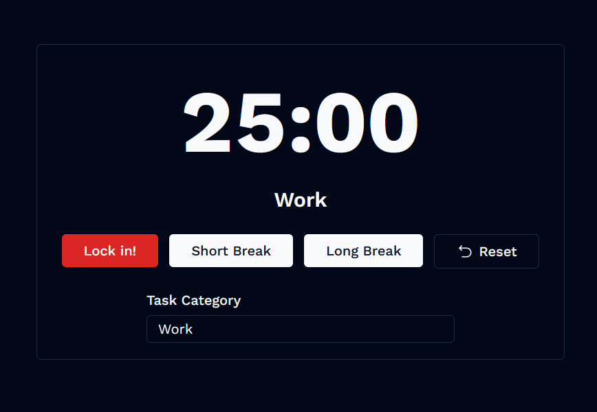
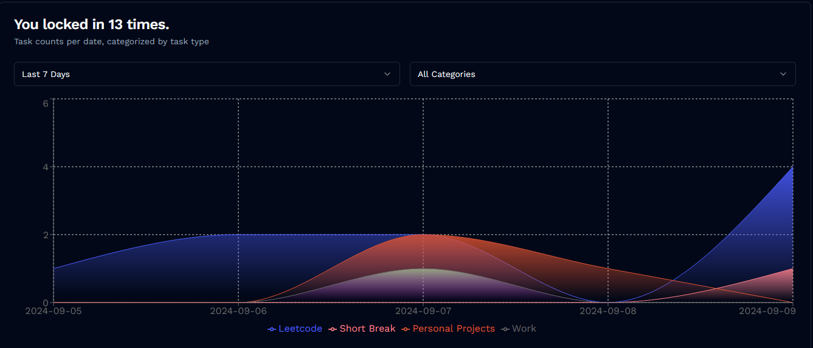
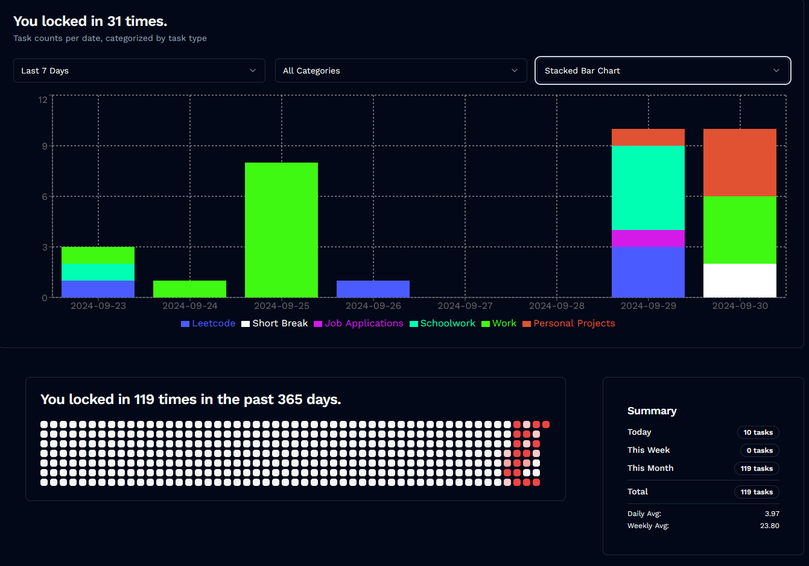
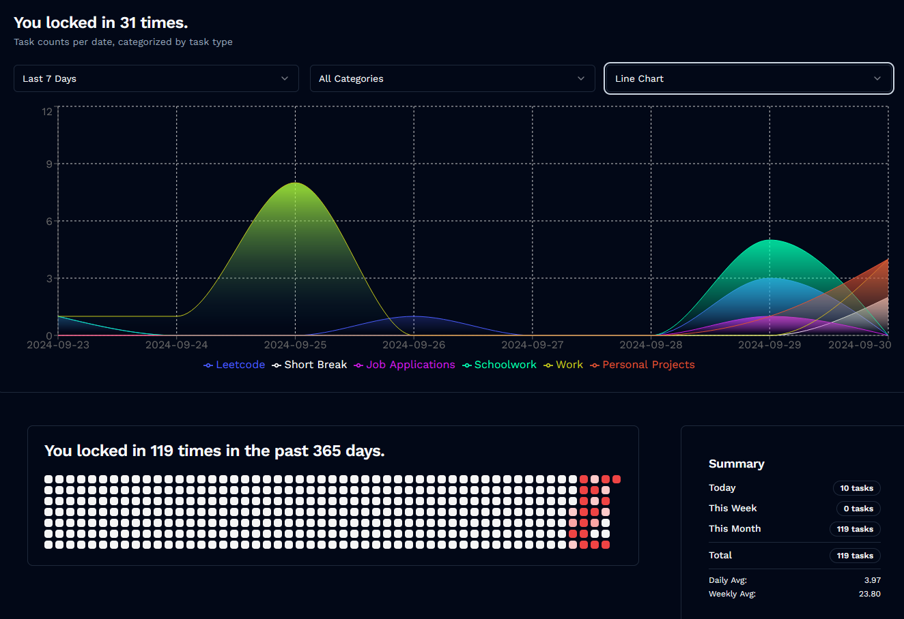
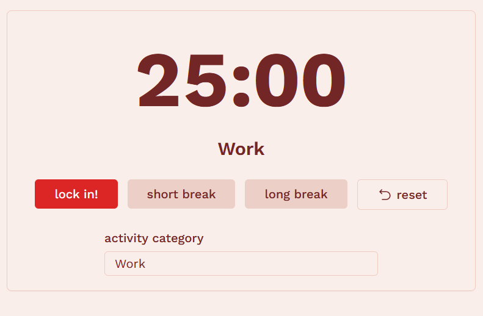
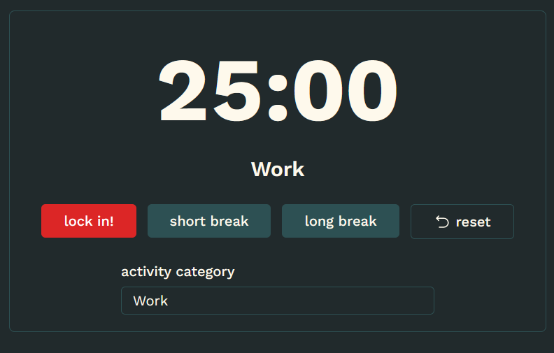
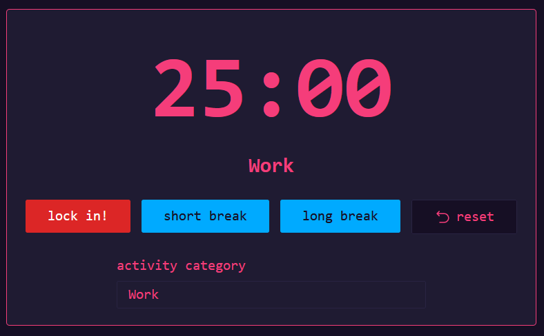
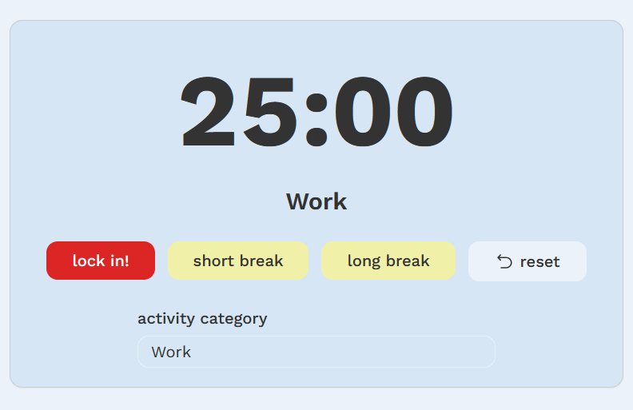

# solanum
#### tomato timer for productivity mangement and tracking

I built this [simple tomato timer](https://lockdin.vercel.app) using [Venefish](https://github.com/enesien/venefish) as the one I had been using for a few years doesn't allow me to categorize tasks. 

## Features 
- Configurable timer durations and categories
- Tab notifications
- Statistics and history tracking
- Short and long breaks
- Light and dark mode
- Different themes

## Planned features
- Scheduled timers
- Enhanced statistics and logging
- Cleaner code

## Examples
### Stats view
#### Stacked bar chart

#### Line chart

### Themes
#### cherry

#### dark solarized

#### cyberpunk

#### pastel
